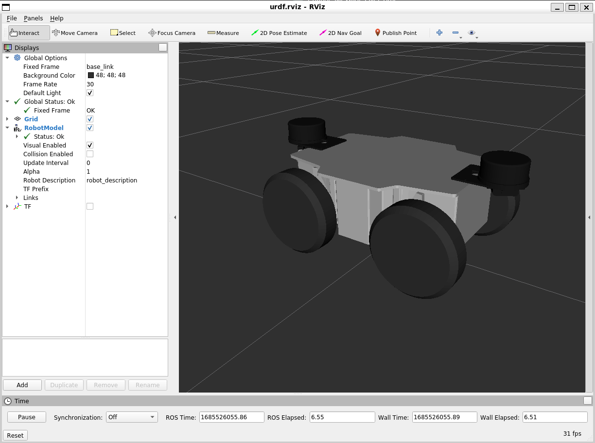

# メカナムローバーの3Dモデルのパッケージ



## 準備
ヴイストンの台車ロボットのオプションを表示する場合は、`vs_rover_options_description`というパッケージを`src`フォルダーにクローンしてください。（詳細は[こちら](https://github.com/vstoneofficial/vs_rover_options_description.git)を参照してください）
```bash
git clone https://github.com/vstoneofficial/vs_rover_options_description.git
```
1. 対応するオプション
   - LRF TG30

2. 使用状況に応じて、[mecanum3.xacro](./urdf/mecanum3.xacro)ファイルの8行目にある使用しないオプションをコメントアウトしてください。

## 構成

- `urdf/`
  - 各ロボットの Xacro、Gazebo 用定義、ros2_control 用定義
- `meshes/`
  - 3D モデル
- `launch/`
  - RViz 表示用 launch
- `rviz/`
  - RViz 設定ファイル
- `params/`
  - ros2_control のコントローラ設定
- `scripts/`
  - 補助ノードや設定ファイル


## RViz上の可視化

ロボットモデルを表示します。`rover:=` で機種を切り替えます。

```bash
ros2 launch mecanumrover_description display.launch.py rover:=mecanum3
```

`rover:=` で指定できる値:
- `mecanum3`
- `g120a`
- `g40a_lb`

### 既定のモデルを確認

`mecanum3` を表示する場合:

```bash
ros2 launch mecanumrover_description display.launch.py rover:=mecanum3
```

`g120a` を表示する場合:

```bash
ros2 launch mecanumrover_description display.launch.py rover:=g120a
```

`g40a_lb` を表示する場合:

```bash
ros2 launch mecanumrover_description display.launch.py rover:=g40a_lb
```
